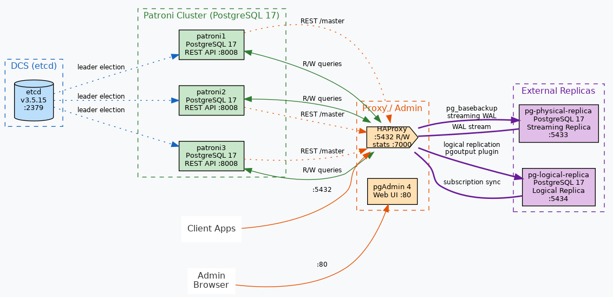

# Patroni Cluster — PostgreSQL 17 + Patroni + pgAdmin

Отказоустойчивый кластер PostgreSQL 17 (3 ноды) с Patroni, etcd, haproxy и pgAdmin в Docker Compose.

## Требования

- Docker Engine 24+
- Docker Compose v2

## Сборка образа Patroni

Образ строится на основе `postgres:17` (Debian Bookworm, ~620 MB). В него добавляется Python и Patroni:

```dockerfile
FROM postgres:17

RUN apt-get install -y python3 python3-pip python3-psycopg2 && \
    pip3 install --no-cache-dir --break-system-packages patroni[etcd]
```

### Почему образ большой (~1.18 GB)

| Компонент | Размер |
|-----------|--------|
| `postgres:17` (Debian) | ~620 MB |
| Python 3.13 + pip + apt-зависимости | ~66 MB |
| `python3-psycopg2` (C-extension libpq) | ~40 MB (в составе apt) |
| pip-пакеты (patroni, etcd, requests, PyYAML и др.) | ~22 MB |
| apt-кэш (чистится) | 0 MB |
| **Итого** | **~1.18 GB** |

Основные причины размера:
- **Debian, не Alpine** — `postgres:17` на Debian (~620 MB) вместо `postgres:17-alpine` (~250 MB). Alpine экономит ~370 MB, но Patroni (через `python-etcd`) работает стабильнее на glibc.
- **Полный Python 3.13** — интерпретатор, pip, зависимости (~66 MB). Для сравнения: сама patroni — всего ~600 KB кода, но тянет 20 зависимостей.
- **psycopg2 из apt** — компилируется под конкретную версию libpq, что добавляет ~40 MB системных библиотек.

### Сравнение с альтернативами

| Подход | Размер | Плюсы | Минусы |
|--------|--------|-------|--------|
| postgres:17 + pip patroni (текущий) | ~1.18 GB | Стабильность, glibc | Большой образ |
| postgres:17-alpine + pip patroni | ~500 MB | Маленький образ | musl → потенциальные проблемы с python-etcd |
| Готовый zalando/patroni | ~300 MB | Оптимизирован, малый размер | Чужая версия PostgreSQL, сложно кастомизировать |

## Обновление Patroni

Версия Patroni задаётся через build-arg `PATRONI_VERSION` в `patroni-cluster/patroni/Dockerfile` (по умолчанию `4.1.3`).

### Посмотреть текущую версию

```bash
docker run --rm --entrypoint bash patroni-cluster-patroni1 -c "patroni --version"
```

### Обновить до конкретной версии

```bash
docker compose build --build-arg PATRONI_VERSION=4.1.5
docker compose up -d
```

### Обновить версию по умолчанию

Изменить `ARG PATRONI_VERSION=...` в `patroni-cluster/patroni/Dockerfile`.

При обновлении Patroni также стоит проверить совместимость с PostgreSQL в `FROM postgres:17` — Patroni 4.x поддерживает PG 12–17.

## Быстрый старт

```bash
git clone <repo>
cd patroni-cluster

docker compose build
docker compose up -d
```

## Компоненты

| Компонент | Роль | Порт (хост) |
|-----------|------|-------------|
| etcd | Хранилище состояния кластера | 2379 |
| patroni1 | Нода БД #1 | — |
| patroni2 | Нода БД #2 | — |
| patroni3 | Нода БД #3 | — |
| haproxy | Балансировщик к мастер-ноде | 5432 |
| haproxy stats | Статистика | 7000 |
| pgAdmin | Веб-интерфейс | 80 |
| pg-physical-replica | Физическая standby-реплика (streaming) | 5433 |
| pg-logical-replica | Логическая реплика (PUB/SUB) | 5434 |

## Архитектура



Стек состоит из четырёх уровней:

1. **DCS (etcd)** — координация кластера, leader election
2. **Patroni (3 ноды)** — управление PostgreSQL, автоматический failover
3. **HAProxy** — единая точка входа (always-on мастер), health-check через REST API
4. **Реплики** — внешние экземпляры PostgreSQL для разных задач

## Как работает кластер

Кластер использует **Patroni** для управления PostgreSQL и **etcd** как DCS (Distributed Configuration Store).

### Выбор мастера (leader election)

1. Все три ноды Patroni регистрируются в etcd.
2. Нода, которая первой успешно создаёт ключ `/service/patroni_cluster/leader`, становится **мастером** (принимает запись).
3. Остальные ноды становятся **репликами** (только чтение) и запускают `pg_basebackup` с мастера, после чего начинают стриминг WAL.
4. Если мастер падает, Patroni через etcd определяет потерю лидера, и одна из реплик автоматически повышается до мастера.

### Маршрутизация через HAProxy

- HAProxy настроен на **read-write** через порт **5432** — запросы идут только на мастер-ноду.
- HAProxy проверяет каждую ноду через `httpchk GET /master` на порту 8008 (REST API Patroni). Если нода — мастер, она помечается `UP`.
- Клиент всегда подключается к мастеру через `localhost:5432`, не зная, какая именно нода сейчас мастер.

## Как узнать, кто сейчас мастер

### 1. Через HAProxy (самый простой)

Подключитесь к БД через HAProxy и выполните:

```sql
SELECT inet_server_addr();
```

Если нужно только имя хоста:

```sql
SELECT pg_read_file('/etc/hostname');
```

### 2. Через Patroni REST API (любая нода)

```bash
docker compose exec patroni2 python3 -c "
import urllib.request, json
d = json.loads(urllib.request.urlopen('http://127.0.0.1:8008/cluster').read())
for m in d['members']:
    print(m['name'], '→', m['role'], '(' + m['state'] + ')')
"
```

Вывод:
```
patroni1    → replica   (running)
patroni2    → leader    (running)
patroni3    → replica   (running)
```

### 3. Через patronictl

```bash
docker compose exec patroni2 patronictl list
```

### 4. Через HAProxy stats (браузер)

Открой http://localhost:7000 — в строке `patroni_cluster` зелёным подсвечена активная мастер-нода.

## Проверка кластера

### Статус Patroni

```bash
# любой нодой
curl -s http://localhost:5001/patroni | jq .

# кластер
docker exec patroni-cluster-patroni1-1 patronictl list
```

### Подключение к БД

```bash
# через haproxy (всегда на мастер)
psql -h localhost -p 5432 -U postgres -d shop

# напрямую к ноде (patroni1 — 5001, patroni2 — 5002, patroni3 — 5003)
psql -h localhost -p 5001 -U postgres -d shop
```

Пароль: `secret`

### Тестовые данные

```sql
SELECT * FROM users;
SELECT * FROM products;
SELECT * FROM orders;
```

### pgAdmin

Открой http://localhost:80

- **Email:** admin@admin.com
- **Password:** admin

Сервер `Patroni Cluster (via haproxy)` уже зарегистрирован.

### Тест отказоустойчивости

```bash
# остановить мастер-ноду
docker compose stop patroni1

# через несколько секунд haproxy переключится на другую ноду
# проверить, кто стал мастером
curl -s http://localhost:7000 | grep -o 'patroni[0-9]'

# подключение к БД продолжает работать
psql -h localhost -p 5432 -U postgres -d shop -c "SELECT inet_server_addr();"

# вернуть ноду
docker compose start patroni1
```

## Репликация DML

DML-операции (INSERT, UPDATE, DELETE) проходят по трём независимым путям репликации:

### 1. Внутри кластера Patroni (patroni1/2/3)

```
Клиент → HAProxy :5432 → Patroni-мастер
                              ↓
                    WAL streaming (синхронный/асинхронный)
                              ↓
                   Patroni-реплики (read-only)
```

- DML выполняется только на **мастере** (HAProxy направляет все write-запросы на него).
- Мастер записывает изменения в WAL, реплики получают WAL через **streaming replication** и применяют.
- Реплики Patroni **read-only** — DML на них не выполняется.
- Задержка репликации отслеживается через `pg_stat_replication`.

### 2. Физическая реплика (pg-physical-replica :5433)

```
Мастер Patroni → HAProxy :5432 → pg-physical-replica
                                    ↓
                          WAL streaming (standby)
                                    ↓
                          Read-only копия данных
```

- После `pg_basebackup` реплика подключается к HAProxy (`host=haproxy port=5432`) с `primary_conninfo` и постоянно стримит WAL.
- Все DML с мастера попадают на физическую реплику **автоматически**, включая DDL, VACUUM, CREATE INDEX и т.д.
- Реплика **read-only** — запись заблокирована на уровне `standby.signal`.
- Лаг репликации можно проверить:
  ```sql
  SELECT application_name, state,
         pg_size_pretty(pg_wal_lsn_diff(pg_current_wal_lsn(), replay_lsn)) AS lag
  FROM pg_stat_replication;
  ```

### 3. Логическая реплика (pg-logical-replica :5434)

```
Мастер Patroni → HAProxy :5432 → pg-logical-replica
                                    ↓
                    Logical replication (PUB/SUB)
                    Publication: shop_pub (таблицы users, products, orders)
                    Subscription: shop_sub (слот shop_sub)
                                    ↓
                    DML применяется к соответствующим таблицам
```

- Логическая реплика подписывается на **публикацию** `shop_pub`, созданную на мастере в `patroni-cluster/patroni/init.sh:49-57`.
- Публикация включает таблицы: `users`, `products`, `orders`.
- Подписка `shop_sub` использует постоянный слот `shop_sub`, который автоматически создаётся на каждом новом мастере благодаря настройке `bootstrap.dcs.slots` в конфигурации Patroni.
- **Реплицируется только DML** (INSERT, UPDATE, DELETE) на подписанных таблицах. DDL, индексы, sequences, VACUUM и TRUNCATE **не реплицируются**.
- Направление репликации — **однонаправленное**: только с мастера на логическую реплику. Изменения на логической реплике **не попадают** обратно на мастер.
- Таблицы на логической реплике **не read-only** технически (нет `standby.signal`), но запись в них нарушает консистентность:
  - Данные, записанные напрямую на логической реплике, будут **перезаписаны** при следующем apply из подписки.
  - Первичные ключи, конфликтующие с данными мастера, приведут к ошибке подписки.

### Сводная таблица

| Операция | Patroni-реплики | Физическая реплика | Логическая реплика |
|----------|----------------|-------------------|-------------------|
| INSERT / UPDATE / DELETE | Да (через WAL) | Да (через WAL) | Да (через PUB/SUB) |
| DDL (ALTER TABLE, CREATE INDEX) | Да (через WAL) | Да (через WAL) | **Нет** |
| VACUUM / TRUNCATE | Да (через WAL) | Да (через WAL) | **Нет** |
| Запись напрямую | Read-only | Read-only | Возможно, но нарушает консистентность |
| Задержка | ms–s | ms–s | ms–min (зависит от `wal_retrieve_retry_interval`) |

### Как проверить, что DML реплицируется

**Физическая реплика (:5433):**
```sql
-- проверить, что данные есть
SELECT count(*) FROM shop.users;

-- проверить статус streaming
SELECT application_name, state, sync_state FROM pg_stat_replication;
```

**Логическая реплика (:5434):**
```sql
-- проверить статус подписки
SELECT subname, subenabled, subtwophasestate FROM pg_subscription;

-- проверить apply worker
SELECT pid, state, wait_event FROM pg_stat_activity
WHERE backend_type LIKE '%logical replication%';

-- проверить последний полученный LSN
SELECT * FROM pg_stat_subscription;
```

### Когда DML может потеряться

1. **Физическая реплика** — риск потери только при повреждении WAL на мастере (pg_rewind / восстановление из бэкапа).
2. **Логическая реплика** — риск потери при:
   - Достижении `max_slot_wal_keep_size` на мастере (слот удалён) — нужна повторная настройка подписки.
   - DDL на мастере без соответствующего DDL на логической реплике (подписка падает с ошибкой).
   - Конфликте primary key (одинаковый PK, разные данные).
3. **Patroni-кластер** — синхронный режим выключен (`synchronous_mode: false`), возможна потеря последних транзакций при жёстком сбое мастера (асинхронный commit).

## Обслуживание БД

В кластере есть три категории баз данных, и каждая требует своего подхода при изменениях схемы:

| Категория | Характеристика | Запись | DDL |
|-----------|---------------|--------|-----|
| **Patroni-кластер** (patroni1/2/3) | Managed by Patroni, автоfailover | Только мастер | На мастере, автоматически реплицируется |
| **Физическая реплика** (pg-physical-replica) | Streaming WAL, read-only | Нет | Нет (копия с мастера) |
| **Логическая реплика** (pg-logical-replica) | Logical replication, read-only через подписку | Нет | Нет (копия через publication) |

### Как добавлять / удалять таблицы

**Добавление таблицы:**

1. Создать таблицу на **мастере** Patroni:
   ```sql
   CREATE TABLE shop.categories (
       id SERIAL PRIMARY KEY,
       name VARCHAR(100) NOT NULL
   );
   ```
2. На мастер-кластере таблица появится на всех трёх нодах (streaming replication).
3. Физическая реплика получит таблицу автоматически (WAL streaming).
4. Для логической реплики — добавить таблицу в publication:
   ```sql
   ALTER PUBLICATION shop_pub ADD TABLE shop.categories;
   ```
5. На логической реплике таблица появится автоматически (подписка активна).

**Удаление таблицы:**

1. `DROP TABLE` на мастере — удалится везде (кроме логической реплики).
2. Удалить из publication:
   ```sql
   ALTER PUBLICATION shop_pub DROP TABLE shop.categories;
   ```
3. На логической реплике выполнить `DROP TABLE IF EXISTS shop.categories;`

### Как добавлять / удалять поля и ограничения

Все DDL выполняются **только на мастере** Patroni:

```sql
-- добавить поле
ALTER TABLE shop.users ADD COLUMN phone VARCHAR(20);

-- удалить поле
ALTER TABLE shop.users DROP COLUMN phone;

-- добавить ограничение
ALTER TABLE shop.products ADD CONSTRAINT chk_price CHECK (price > 0);

-- удалить ограничение
ALTER TABLE shop.products DROP CONSTRAINT chk_price;
```

- **Физическая реплика** — изменения применяются автоматически (WAL streaming).
- **Логическая реплика** — DDL не реплицируются логической репликацией.
  ⚠️ После ALTER TABLE на мастере нужно **вручную выполнить тот же DDL на логической реплике**, иначе подписка упадёт с ошибкой.
- Рекомендуется временно отключать подписку на время массовых DDL:
   ```sql
   ALTER SUBSCRIPTION shop_sub DISABLE;
   -- выполнить DDL на мастере и логической реплике
   ALTER SUBSCRIPTION shop_sub ENABLE;
   ```

### Восстановление логической реплики после сбоя

Если на логической реплике удалена таблица, нарушена ссылочная целостность или подписка упала с ошибкой apply, необходимо пересоздать подписку с полной синхронизацией данных.

**Сценарий: удалена таблица `bookings.flights` на логической реплике**

```sql
-- 1. На логической реплике: удалить подписку
ALTER SUBSCRIPTION shop_sub DISABLE;
DROP SUBSCRIPTION shop_sub;

-- 2. Создать таблицу заново (такой же DDL, как на мастере)
CREATE TABLE bookings.flights (
    flight_id           SERIAL PRIMARY KEY,
    route_no            TEXT NOT NULL,
    status              TEXT NOT NULL CHECK (status IN ('Scheduled','On Time','Delayed','Boarding','Departed','Arrived','Cancelled')),
    scheduled_departure TIMESTAMPTZ NOT NULL,
    scheduled_arrival   TIMESTAMPTZ NOT NULL CHECK (scheduled_arrival > scheduled_departure),
    actual_departure    TIMESTAMPTZ,
    actual_arrival      TIMESTAMPTZ
);

-- 3. Пересоздать подписку с copy_data = true (скопирует все существующие данные)
CREATE SUBSCRIPTION shop_sub
CONNECTION 'host=haproxy port=5432 dbname=shop user=postgres password=secret'
PUBLICATION shop_pub
WITH (copy_data = true, create_slot = false);
```

**Если испорчено несколько таблиц или вся схема:**

```sql
-- 1. Удалить подписку
DROP SUBSCRIPTION IF EXISTS shop_sub;

-- 2. Удалить и пересоздать всю схему bookings
DROP SCHEMA bookings CASCADE;
-- затем выполнить все CREATE TABLE из patroni-cluster/patroni/demo-airlines.sql
-- (кроме INSERT — данные скопируются через copy_data)

-- 3. Пересоздать подписку
CREATE SUBSCRIPTION shop_sub
CONNECTION 'host=haproxy port=5432 dbname=shop user=postgres password=secret'
PUBLICATION shop_pub
WITH (copy_data = true, create_slot = false);
```

**Быстрый способ — пересоздать контейнер:**
```bash
docker compose rm -sf pg-logical-replica
docker compose up -d pg-logical-replica
```
Контейнер выполнит полную переинициализацию: initdb → создание таблиц → CREATE SUBSCRIPTION с `copy_data = true`.

**Рекомендации по предотвращению:**

- **Не выполнять DDL напрямую на логической реплике** — все изменения схемы только на мастере, затем повторять те же DDL на реплике вручную
- **Перед массовыми DDL** временно отключать подписку (`ALTER SUBSCRIPTION shop_sub DISABLE`), выполнить DDL на мастере и реплике, затем включить (`ENABLE`)
- **Не записывать данные напрямую** на логическую реплику — они будут перезаписаны при следующем apply или вызовут конфликт первичных ключей
- **Мониторить статус подписки:**
  ```sql
  SELECT subname, subenabled, subtwophasestate FROM pg_subscription;
  SELECT pid, state, wait_event FROM pg_stat_activity
  WHERE backend_type LIKE '%logical replication%';
  ```
- **Проверять лаг репликации** после интенсивной записи на мастере

### Как добавлять / удалять индексы

```sql
-- создать индекс (на мастере)
CREATE INDEX idx_users_email ON shop.users(email);

-- удалить индекс
DROP INDEX idx_users_email;
```

- Физическая реплика получит изменения индексов через WAL.
- Логическая реплика НЕ реплицирует DDL индексов — выполнить вручную:
  ```sql
  CREATE INDEX idx_users_email ON shop.users(email);
  ```

### Обслуживание индексов и таблиц

| Операция | Команда | Когда делать |
|----------|---------|-------------|
| VACUUM | `VACUUM (VERBOSE, ANALYZE) shop.users;` | При росте мёртвых кортежей (>20%) |
| ANALYZE | `ANALYZE shop.users;` | После массовых изменений (>10% строк) |
| REINDEX | `REINDEX INDEX idx_users_email;` | При разбухании индекса (bloat) |

Autovacuum включён по умолчанию. Наблюдать за статистикой:

```sql
-- мёртвые кортежи
SELECT relname, n_dead_tup, n_live_tup,
       round(n_dead_tup * 100.0 / (n_live_tup + n_dead_tup + 1), 1) AS dead_pct
FROM pg_stat_user_tables WHERE n_dead_tup > 0 ORDER BY n_dead_tup DESC;

-- размер индексов
SELECT indexrelid::regclass, pg_size_pretty(pg_relation_size(indexrelid))
FROM pg_stat_user_indexes ORDER BY pg_relation_size(indexrelid) DESC;
```

VACUUM и ANALYZE можно выполнять на любой реплике (только для чтения статистики). Полноценный VACUUM для освобождения места — только на мастере.

## Мониторинг (концепция)

### Ключевые метрики

| Группа | Метрика | Что показывает | Порог тревоги |
|--------|---------|---------------|--------------|
| **Кластер** | Состояние лидера | Какая нода мастер | Любое изменение ≠ ожидаемый мастер |
| **Кластер** | Число нод в `running` | Все ли ноды живы | < 3 |
| **Кластер** | Replication lag | Отставание реплик (байты) | > 50 MB |
| **Patroni** | `patroni.clocks.ts` | Timestamp API | Не обновляется > 30s |
| **PG** | Connections (`numbackends`) | Активные соединения | > 80% от max_connections |
| **PG** | Dead tuples (`n_dead_tup`) | Мусор в таблицах | > 20% живых кортежей |
| **PG** | Cache hit ratio (`blks_hit / blks_read`) | Эффективность кэша | < 95% |
| **PG** | Transaction rate (`xact_commit + xact_rollback`) | Активность БД | Резкое падение → проблема |
| **OS** | CPU, RAM, Disk | Ресурсы хоста | CPU > 80%, RAM < 10%, Disk < 20% |

### Откуда брать метрики

- **Patroni REST API** (`GET /cluster`, `GET /health`) — состояние лидера, лаг реплик
- **pg_stat_*** представления — статистика PostgreSQL
- **HAProxy stats** (`:7000`) — состояние бэкендов, количество сессий
- **Docker** (`docker stats`) — ресурсы контейнеров

### Рекомендуемые проверки

```sql
-- лаг репликации (на мастере)
SELECT application_name, state, sync_state,
       pg_size_pretty(pg_wal_lsn_diff(pg_current_wal_lsn(), replay_lsn)) AS lag
FROM pg_stat_replication;

-- здоровье Patroni
-- GET http://localhost:8008/health

-- активность (на мастере)
SELECT pid, state, wait_event, query_start, left(query, 60)
FROM pg_stat_activity WHERE state != 'idle' ORDER BY query_start;
```

## Остановка

```bash
docker compose down        # остановить
docker compose down -v     # остановить и удалить данные
```
