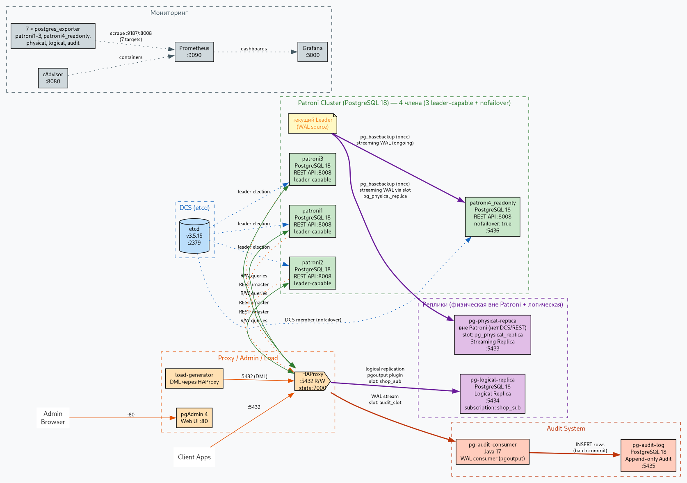

# Patroni Cluster — PostgreSQL 18 + Patroni + pgAdmin

Отказоустойчивый кластер PostgreSQL 18 (Patroni: 3 leader-capable + 1 реплика `nofailover` в составе кластера + 1 физическая реплика вне Patroni) с etcd, haproxy и pgAdmin в Docker Compose.



## Документация

1. [Компоненты и архитектура](docs/components.md) — сборка образа, обновление Patroni, описание всех сервисов, как работает кластер
2. [Репликация данных и аудит-лог](docs/replication.md) — DML-репликация, аудит через WAL consumer, восстановление слотов при смене лидера
3. [Обслуживание БД](docs/maintenance.md) — DDL, индексы, восстановление логической реплики
4. [Мониторинг и ограничения](docs/monitoring.md) — метрики, проверки репликации, проблемы на Windows, `moveusername`
5. [Известные проблемы](docs/issues.md) — ограничения hot standby (физическая реплика), Postgres Pro Enterprise 18.4.1
6. [Тесты репликации](docs/replication-tests.md) — описание тестов (pytest/docker) и как их запускать

## Требования

### Инфраструктурные

| Компонент | Минимальная версия | Назначение |
|-----------|-------------------|------------|
| Docker Engine | 24+ | Контейнеризация всех сервисов |
| Docker Compose | v2 | Оркестрация multi-container среды |

### Программные

| Компонент | Версия | Где используется | Трассировка |
|-----------|--------|------------------|-------------|
| PostgreSQL | 18 | Patroni-кластер (4 ноды), физическая реплика, логическая реплика, pg-audit-log | `patroni-cluster/patroni/Dockerfile`, `replica-physical/`, `replica-logical/`, `pg-audit-log/` |
| Patroni | 4.1.3 | Управление HA, failover, выборы лидера | `patroni-cluster/patroni/Dockerfile` (аргумент `PATRONI_VERSION`) |
| etcd | 3.5+ | DCS — хранение состояния кластера | `patroni-cluster/docker-compose.yml` (сервис `etcd`) |
| HAProxy | 2.9+ | Балансировка, маршрутизация R/W → мастер | `patroni-cluster/haproxy/haproxy.cfg` |
| Java | 17 | WAL consumer (pg-audit-consumer) | `patroni-cluster/pg-audit-consumer/Dockerfile` |
| Gradle | 8.7 | Сборка pg-audit-consumer (shadow JAR) | `patroni-cluster/pg-audit-consumer/build.gradle.kts` |

### Первичные требования и статус выполнения

| # | Требование | Статус | Комментарий |
|---|------------|--------|-------------|
| 1 | Patroni-кластер из 4 нод с отказоустойчивостью | ✅ Выполнено | 4 ноды (patroni1/2/3 leader-capable + patroni4_readonly `nofailover`), etcd DCS, HAProxy маршрутизирует R/W → мастер. При падении мастера — автоматический failover, HAProxy переключает на новую ноду ([components.md](docs/components.md)) |
| 2 | Логическая репликация из Patroni с восстановлением при смене лидера | ✅ Выполнено | Слот `shop_sub` — permanent DCS slot, автоматически создаётся на новом мастере. Подписка `shop_sub` на pg-logical-replica, `copy_data = true` ([replication.md](docs/replication.md)) |
| 3 | Физическая репликация с восстановлением при смене лидера | ✅ Выполнено | Две физические реплики: `patroni4_readonly` (`:5436`) — член Patroni (`nofailover: true`); `pg-physical-replica` (`:5433`) — **вне Patroni** (нет etcd/REST), стримит через постоянный физический слот `pg_physical_replica`. При смене лидера обе автоматически следуют за новым мастером ([replication.md](docs/replication.md)) |
| 4 | Логическая репликация в аудит-БД через WAL Consumer (Java) | ✅ Выполнено | Слот `audit_slot` — permanent DCS slot. pg-audit-consumer (Java 17, Gradle 8.7) потребляет WAL через SQL-интерфейс, пишет в pg-audit-log. Слот автоматически восстанавливается при смене лидера ([replication.md](docs/replication.md)) |
| 5 | Временные таблицы и хранимые процедуры на физической реплике | ❌ Не выполнено | В upstream PostgreSQL 18 hot standby работает в read-only режиме — `CREATE TEMP TABLE` и DML запрещены. Решение: Postgres Pro Enterprise 18.4.1 с параметрами `enable_standby_temp_tables` + `enable_temp_memory_catalog` ([issues.md](docs/issues.md)) |
| 6 | Запись имени пользователя при изменении на pg-audit | ⚠️ Ограничение | pgoutput v1 не передаёт имя пользователя в WAL-потоке. `moveusername` всегда `'wal_consumer'`. Решение: колонка `modified_by TEXT DEFAULT current_user` на мастере ([issues.md](docs/issues.md)) |

> **Альтернативы компонентов.** `pg-physical-replica` и `patroni4_readonly` — два альтернативных способа получить физическую read-only копию (вне Patroni по слоту ↔ член Patroni с `nofailover`); `pg-logical-replica` и `pg-audit-consumer` — два альтернативных способа использовать логическую репликацию (копия данных ↔ журнал операций `i/u/d`). В топологии присутствуют все четыре ([components.md](docs/components.md) → «Альтернативные компоненты»).

## Быстрый старт

```bash
git clone <repo>
cd patroni-cluster

docker compose build
docker compose up -d
```

## Как узнать, кто сейчас мастер

### 1. Через HAProxy (самый простой)

Подключитесь к БД через HAProxy и выполните:

```sql
SELECT inet_server_addr();
```

Если нужно только имя хоста:

```sql
SELECT pg_read_file('/etc/hostname');
```

### 2. Через Patroni REST API (любая нода)

```bash
docker compose exec patroni2 python3 -c "
import urllib.request, json
d = json.loads(urllib.request.urlopen('http://127.0.0.1:8008/cluster').read())
for m in d['members']:
    print(m['name'], '→', m['role'], '(' + m['state'] + ')')
"
```

Вывод:
```
patroni1              → leader    (running)
patroni2              → replica   (running)
patroni3              → replica   (running)
patroni4_readonly     → replica   (running)   (nofailover)
```

### 3. Через patronictl

```bash
docker compose exec patroni2 patronictl list
```

### 4. Через HAProxy stats (браузер)

Открой http://localhost:7000 — в строке `patroni_cluster` зелёным подсвечена активная мастер-нода.

## Проверка кластера

### Статус Patroni

```bash
# REST API любой ноды (порт 8008 не проброшен на хост — команда выполняется внутри контейнера)
docker compose exec patroni1 curl -s http://localhost:8008/patroni

# кластер
docker compose exec patroni1 patronictl list
```

### Подключение к БД

```bash
# через haproxy (всегда на мастер)
psql -h localhost -p 5432 -U postgres -d shop

# физические реплики (только чтение)
psql -h localhost -p 5433 -U postgres -d shop   # pg-physical-replica (вне Patroni)
psql -h localhost -p 5436 -U postgres -d shop   # patroni4_readonly (member, nofailover)

# напрямую к узлу patroni1/2/3 — хост-портов нет, только внутри Docker:
docker compose exec patroni1 psql -U postgres -d shop
```

Пароль: `secret`

### Тестовые данные

```sql
SELECT count(*) FROM bookings.flights;
SELECT * FROM bookings.airports_data LIMIT 5;
```

### pgAdmin

Открой http://localhost:80

1. **Email:** admin@admin.com
2. **Password:** admin

Сервер `Patroni Cluster (via haproxy)` уже зарегистрирован (всего 5 серверов — см. `docs/components.md`).

### Тест отказоустойчивости

```bash
# остановить мастер-ноду
docker compose stop patroni1

# через несколько секунд haproxy переключится на другую ноду
# проверить, кто стал мастером
curl -s http://localhost:7000 | grep -o 'patroni[0-9]'

# подключение к БД продолжает работать
psql -h localhost -p 5432 -U postgres -d shop -c "SELECT inet_server_addr();"

# вернуть ноду
docker compose start patroni1
```

## Источники и материалы

- [Patroni — документация](https://patroni.readthedocs.io/) — REST API, параметры, permanent slots (`bootstrap.dcs.slots`)
- [PostgreSQL 18 — логическая репликация](https://www.postgresql.org/docs/18/logical-replication.html) — PUB/SUB, слоты
- [PostgreSQL 18 — hot standby](https://www.postgresql.org/docs/18/hot-standby.html) — read-only реплики
- [HAProxy — настройка балансировки](https://www.haproxy.org/documentation/) — health-check, маршрутизация R/W
- [etcd — документация](https://etcd.io/docs/) — DCS для Patroni
- [Docker Compose — справочник](https://docs.docker.com/compose/) — сервисы, сети, named volumes
- [postgrespro/demodb](https://github.com/postgrespro/demodb) — демо-данные авиационной БД (схема соответствует `demo-airlines.sql`)
- [Habr — обновление PostgreSQL 18](https://habr.com/ru/companies/postgrespro/articles/870660/) — новые возможности PG18
- [pgAdmin — документация](https://www.pgadmin.org/docs/) — веб-интерфейс управления

## Остановка

```bash
docker compose down        # остановить
docker compose down -v     # остановить и удалить данные
```
